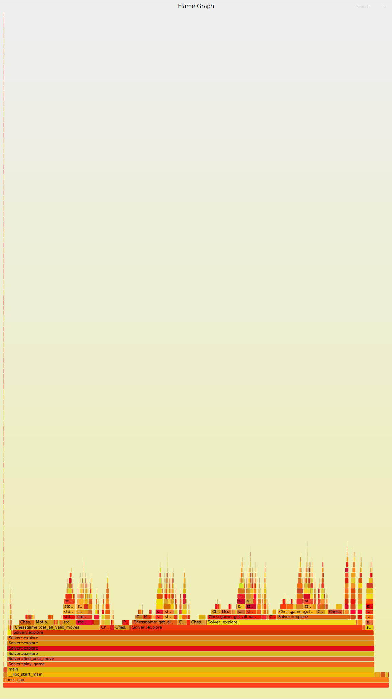

# Chess Engine in C++

> A. Bricq

Here's my **chess engine**, written completely from scratch in C++, probably able to defeat you at chess ! To get started and try it yourself, go at the installation [instruction](#installation)

I started programming chess when I realized what an intellectual problem it was and it turned out to be pretty challenging. The result is a **fully functional chess engine**, with *almost* all of the chess rules, able to play in real time to a level ~1500 ELO. The only rules which I haven't - yet - added are prise en-passant and promotion into not a queen (both of them are actually trivial, just I haven't found the time).

The engine only uses standard libraries (`std`) and the graphics library `sf`, therefore really easy to compile.

There's a still a few more improvements I would like to do, which are listed below, but the engine is now fully usable from a UI.
- completely finish the rules
- a better user interface, with maybe some insights about the solver
- a way to navigate through the moves (back and forth) and to start a new game 

## Development instructions

### Installation

**Dependencies**
- sfml: `sudo apt install libsfml-dev` (*I believe*)
- C++ 14 (at least)
- cmake

Just use the following commands (should work on basically any computer)

```console 
git clone <...>
cd chess_cpp
mdkir build 
cd build
cmake -DCMAKE_BUILD_TYPE=Release ..
make
./chess_cpp
```

If, when you run the code, you don't see a chessboard or you see some weird pieces arrangment, it's probably that there is some debugging code in the main() function. Go check in the constructor of `Chessgame`, that it calls the function `Chessgame::create_normal_game()`

Where to change the level of the exploration ? In `Solver::play_game()` (in src/solver.cpp)

### How to profile the code (Linux only)

You may want to know where the code takes time

```console
cmake -DCMAKE_BUILD_TYPE=RelWithDebInfo ..
make
sudo perf record -g ./chess_cpp 
sudo cp perf.data ../../../FlameGraph/
```

And then, where you clone FlameGraph (https://www.brendangregg.com/flamegraphs.html) you just run the line 

```
sudo perf script | ./stackcollapse-perf.pl | ./flamegraph.pl > chess.svg
```

The output is a .svg image (you should open it with Firefox !) that probably looks like this



## About the implementation

Making a chess engine is a rather challenging programming exercise. Here are a few facts about my C++ implementation.

- About the implementation of the game: 
	- I represent a chessgame as a flatten matrix of pointers to Pieces. Basically, an empty square is the nullptr. A square with a piece points to the memory location of the piece. You can move pieces by using references to the pointers involved (it's a little tricky, but rather simple)
	- A chessgame evolves through "Motions" describing how pieces move. For a motion to be valid, it has to verify a set of rules. It's the chessgame that's in charge of checking if a move is valid, and in charge of executing the move.
	- The set of rules (currently) excludes castling and en-passant, but all other rules are implemented
- Once the game is implemented, the interesting part starts: the Chess Engine. Writing a good (i.e. fast) chess engine is really the most challenging part of the problem.
	- My solver is a recursive function that implements a **progressive** (without making copies) **min-max search algorithm** , boosted by **alpha-beta prunning** & **move ordering**.
	- The evaluation function is rather simple, it (currently) just sums up the points of the pieces. 
- There is a simplistic user interface done with SFML, if I find time I will work on it to make it nicer.

### All possible moves

Knowing all the attacked pieces by one player is important. It allows to: 
- castling rules
- score computation

However, the implement must meet a certain number of requirements. We know all the valid moves for current player. But what matters for castling rules are the attacked pieces of the previous rounds. 

Assuming the solver has to play. It calls the function with black players and gets the list of all the possible attacked pieces of black. 

(i) So we have to always keep in memory: 
- the attacked pieces of white 
- the attacked pieces of black

(ii) We want this logic to work at the same time
- in the solver, to explore moves
- when the player moves
which means there will probably need to have some sort of copy-pasting of the code, or a function to take care of it. 

(iii) We also want to be able to step back in the hierarchy of attacked moves (to be able to come back...). For this, we have to have an architecture which allow for stepping back.

*Possible implementation*
- array<array<int>> white_attacked_pieces & black_attacked_piece: keep track of the real last move (either played by the computer or by the player)
- array<array<array<int>>, level_solver> white_attacked_pieces & black_attacked_piece: stack of previously attacked pieces, specifically used by the solver

Steps
- First, try the rule system without the solver. Only use the manual functions, make sure it works. Also implement a reset way for this computation.
- Then, implement the logic on the solver, especially the way to step back is important
- Then, change the score evaluation to include a benefice for positions which have high number of attacked cases.

**IMPORTANT**: the solution of my problem is to get not only the valid moves for the player who will play, but for both ! 


## TODO List (dev)

- Stop using the position property of Piece.hpp,
- Keep track of all the attacked squares
	- mobility award in the score
	- castling rule
- stop the game when the king is captured ! It's still not implemented when playing the game
- en-passant

**GUI**
- Allow possibility to reverse moves
- Add some text to the right which show (at least) the order of moves

**How to deal with Castling**

Here, I propose instructions on how to deal with castling for my algorithm. 
- Basically, castling is very important and should be rewarded when playing a chess game. But the castling rules are really difficult to implement. 
	- the king is not attacked 
	- the cases that the king will traverse are not attacked
- The difficulty comes from knowing which cases are attacked.
- Actually, knowing which cases are attacked (or at least, having the mechanism to do it) has another advantage: it would allow to design a score function that takes this into account

So here, I propose a mechanism that keeps track on the pieces that are attacked.
- I already compute, before starting to explore some moves, all the possible moves of a given position. (*this is done to order the moves before starting the exploration*)
- Therefore, when doing so, I could keep track of all the 'attacked' squares of this current position.
- Then, I could use this result to know if I can castle. 
- Eventually, this adds extra computation. I could try to do this computation only when the castles hasn't happened.

steps
1. Fix the solver, currently not working with castling: DONE
2. Add the motion of the rooks : DONE
3. Check if the pieces are attacked 
	- fill arrays of attacked pieces when checking the moves ? 
4. Add a reward in the score function for the number of attacked pieces

- find where to keep track of the pieces that are attacked
	- since we want to use this knowledge in the score function, it should be a property of the chessgame.
	- it should also be accessible at any moment to check on a new move

